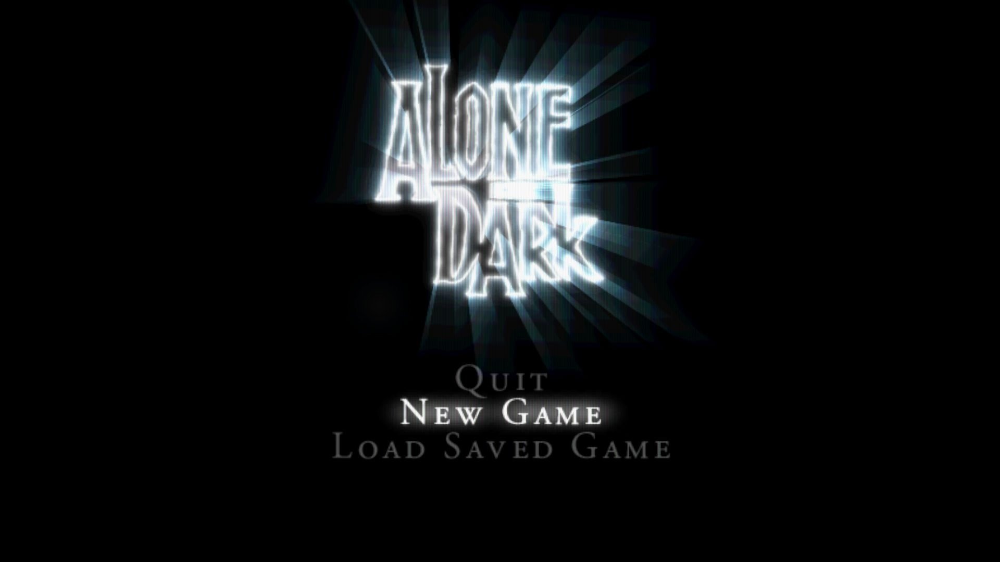
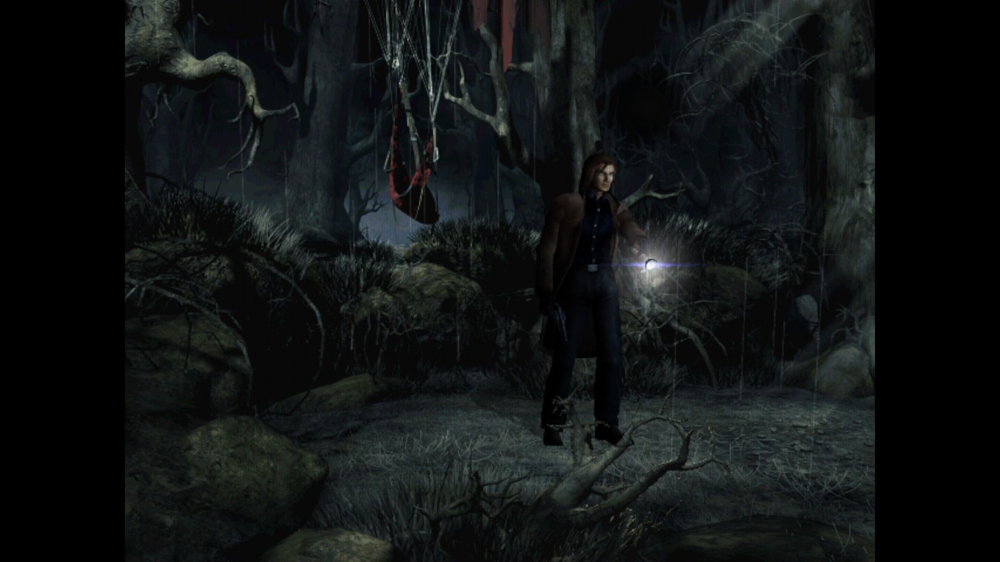
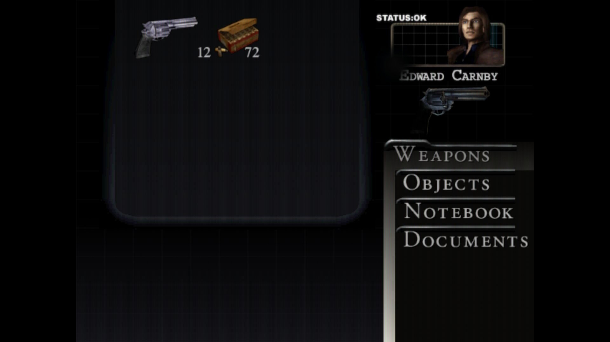


Preserve the original PC game. Restore the parts modern hardware and an incomplete port left behind.


AITD:TNN PC Overhaul is an independent compatibility and preservation layer for the Windows release of *Alone in the Dark: The New Nightmare*. It keeps the original story, game data, sound effects, movies, and executable intact while restoring selected Dreamcast-era features and correcting presentation and input on current systems.


 Interactive Dreamcast audio 
 Proportional 4:3 rendering 
 XInput and original rumble 
 Restored movie flow 
 Fail-closed compatibility 


## In the game

These captures come from the supported PC build with the overhaul active: the title sequence, first playable scene, and inventory all pass through the same proportional OpenGL presentation path.


  
  
  


## What the overhaul restores




The Dreamcast music system follows the PC engine’s live cues. Native PC effects and FMV audio remain on their original paths, so the result is an integration rather than a replacement soundtrack.



Borderless fullscreen, pillarboxing, optional MSAA and anisotropic filtering, VSync, and edge-sampling fixes remove modern-driver friction without inventing widescreen geometry.



The packaged controller layer maps Xbox-compatible devices into the interfaces the game expects, while the game’s retained Dreamcast vibration profiles drive the modern controller motors.



Character confirmation, portrait and title voice, native movie playback, and route setup are reconnected. A runtime ledger records movie requests, opens, frames, and closes for diagnosis.





**Asset boundary:** the user provides their own legitimately acquired PC installation and Dreamcast disc image. The repository does not redistribute either game’s copyrighted assets; the installer extracts the required audio data locally.


## Preservation without rewriting the work

The restraint is deliberate. There is no executable replacement, AI texture pass, widescreen projection, replacement movie system, or stylized color grade. The optional CRT treatment is intentionally modest: scanlines, a subtle aperture grille, and mild halation for the original 640×480 signal.

Address-sensitive modules support one exact executable build and refuse to load elsewhere. Installation and uninstall are ownership-aware: existing files are backed up, modified files are preserved, and unknown additions are never silently deleted. That makes reversibility part of the product rather than an afterthought.

## Engineering surface

The maintained system spans 32-bit C/C++ runtime modules, OpenGL shaders, Dreamcast audio-bank extraction, XInput translation, PowerShell release tooling, and an Inno Setup installer. Release validation covers the integrated payload and a destructive installer lifecycle matrix in a disposable test directory.

## Repository




 Releases

