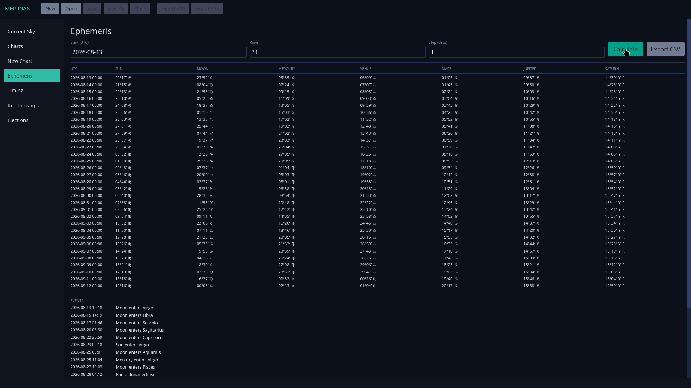


A native traditional-astrology workbench that turns a large historical rule system into inspectable calculations, local research tools, and reproducible searches.


Meridian calculates, inspects, compares, archives, and exports charts using bundled Swiss Ephemeris data and a local city atlas. It is a desktop product rather than a web shell—its calculation engine, archive, resources, and interface travel together on Linux, Windows, and macOS.


 Fully offline 
 Traditional techniques 
 Private local archive 
 Bundled city atlas 
 Native packages 


## Why this is a complex software problem

Astrology is often encountered as loose interpretation, generated horoscope copy, or decorative chart imagery. Meridian addresses a different problem: implementing a specific classical tradition as an explicit and testable computational system.

That requires several layers to agree:

- civil date, local time, historical time-zone rules, latitude, and longitude must resolve to one unambiguous instant;
- Swiss Ephemeris positions and house cusps must be calculated from pinned local data;
- circular geometry must handle aspects, applying and separating motion, retrogradation, lots, antiscia, and exact events across the 0° boundary;
- multiple house systems and day/night reversals change derived results;
- doctrine combines rulership, dignity, sect, solar condition, angularity, reception, and topical significance;
- every conclusion must remain traceable to its inputs and intermediate conditions rather than collapse into an unexplained verdict.

The difficulty is therefore not proving astrology’s premises. It is faithfully encoding a large, internally structured body of rules while keeping astronomical calculation, historical doctrine, persistence, and presentation separate enough to inspect and test.

## The workspace

The chart wheel and inspector are one interactive surface: selecting a planet, aspect, sign, house, angle, or lot highlights every connected element and exposes its exact data. The remaining workspaces keep creation, research, timing, comparison, and retrieval close at hand.


  
  
  


## One application, connected workflows




The resizable wheel, positions list, and inspector expose the same immutable calculated chart. Whole Sign, Equal, Porphyry, Alcabitius, Placidus, Regiomontanus, Campanus, and Morinus houses are available.



Transits, secondary progressions, solar arcs, harmonics, profections, firdaria, returns, planetary hours, and bounded election searches share the same local calculation layer.



Relationship work produces an inspectable comparison and can export its result as SVG, alongside the application’s chart-document and CSV workflows.



New calculations enter a local archive automatically. A `.meridian` document remains editable and portable; SVG and CSV are explicit exports rather than lossy substitutes for the chart.




## Calculation integrity


Meridian reports missing precision data as an error. It does not silently substitute an analytical ephemeris or call a remote service.


Civil times use IANA historical time-zone rules. Ambiguous local times require an explicit fold; nonexistent times are rejected. The calculation surface includes apparent tropical geocentric positions, traditional aspects and orbs, dignity, reception, sect, lots, antiscia, dodecatemoria, and planetary days and hours.


flowchart LR
    input[Local date, time, and place] --> time[IANA time-zone resolution]
    time --> calc[Swiss Ephemeris calculation]
    calc --> chart[Immutable calculated chart]
    chart --> wheel[Interactive workspace]
    chart --> archive[SQLite archive]
    chart --> export[Meridian / SVG / CSV]


## Where SolverForge could fit

Meridian already includes electional search: it evaluates a bounded time range at a chosen interval, calculates a complete chart for every instant, and ranks the candidates from visible testimonies and cautions. This is intentionally transparent—the result is not presented as an oracle, and every score component remains available for inspection.

That search is adequate when the question is simply “which instants rank best under this electional model?” A SolverForge integration becomes useful when the selected time must also satisfy a real planning problem:




Meridian would remain responsible for ephemeris calculation, house construction, doctrine, and the explainable testimony attached to each candidate.



A usable election often involves more than celestial conditions: participants must be available, a venue may have opening hours, travel may be required, and one event may have to precede another.



SolverForge could combine those operational requirements with Meridian’s ranked testimonies, reject infeasible choices, and optimize the remaining tradeoffs across one event or an entire sequence.



The boundary preserves the strength of both systems: Meridian explains the domain calculation; SolverForge explains feasibility and optimization. Neither needs to hide the other behind a single opaque score.





**Current versus potential:** Meridian’s election ranking exists today. The SolverForge planning layer described here is a natural integration path, not a claim that the two applications are already connected.



flowchart LR
    request[Purpose, range, and location] --> meridian[Meridian]
    meridian --> candidates[Calculated candidate instants\nwith visible testimonies]
    reality[Calendars, resources, duration,\ndependencies, and user priorities] --> solver[SolverForge]
    candidates --> solver
    solver --> result[Best feasible time or sequence\nwith constraint and score explanation]


[Explore SolverForge](https://solverforge.org) for the optimization engine and planning ecosystem.

## Native delivery

The same offline data set is packaged into AppImage, DEB, RPM, Windows installer, and universal macOS DMG builds. A companion CLI accepts a JSON request and emits JSON, SVG, or CSV through the same calculation model used by the desktop application.

## Repository




 Download Meridian

