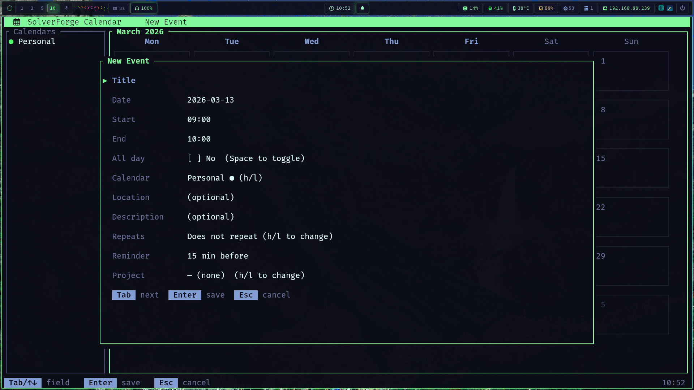


A local-first calendar with two deliberate interfaces: a fast terminal UI for people and a strict JSON CLI for agents and automation.


SolverForge Calendar treats time as structured, operable data. It combines month, week, day, and agenda views with recurring events, local persistence, Google Calendar synchronization, and dependency links between events.


 Four calendar views 
 Dependency-aware events 
 JSON companion CLI 
 Incremental Google sync 
 Desktop reminders 


## The terminal calendar

The TUI keeps navigation, calendar visibility, event editing, quick-add, and synchronization available from the keyboard while background work stays out of the render loop.


  


## Human and automation surfaces


The TUI and CLI are peers over the same model. Automation does not scrape the visual interface, and people do not have to operate a machine-oriented command protocol.


The companion CLI exposes calendars, projects, events, dependencies, and Google sync as JSON-first commands. Successful operations write JSON to standard output; failures write JSON to standard error. Destructive operations require explicit flags such as `--cascade-events` or `--detach-events` instead of hiding consequences behind a prompt.

```bash
solverforge-calendar-cli events create \
  --calendar-id <calendar-id> \
  --title "Planning session" \
  --start-at "2026-08-24 15:00:00" \
  --end-at "2026-08-24 16:00:00"
```

## Events can depend on one another

Dependencies form a directed acyclic graph. Cycle detection prevents an impossible chain from entering the model, while topological ordering makes the relationship usable by higher-level planning and automation.


flowchart LR
    tui[Ratatui TUI] --> model[Calendar model]
    cli[JSON CLI] --> model
    model --> db[(Local SQLite)]
    model --> dag[Event dependency DAG]
    model --> workers[Background worker pool]
    workers --> google[Google Calendar]
    workers --> notify[Desktop notifications]


## Operational choices

- RFC 5545 recurrence and iCalendar import/export keep the data interoperable.
- Incremental sync uses Google sync tokens rather than repeatedly downloading an entire calendar.
- OAuth credentials live in the operating system keyring, not in the SQLite database.
- Channel-based workers isolate database and network latency from terminal input and rendering.
- The terminal palette can follow the surrounding SolverForge Linux environment.

## Repository




 Source and installation

