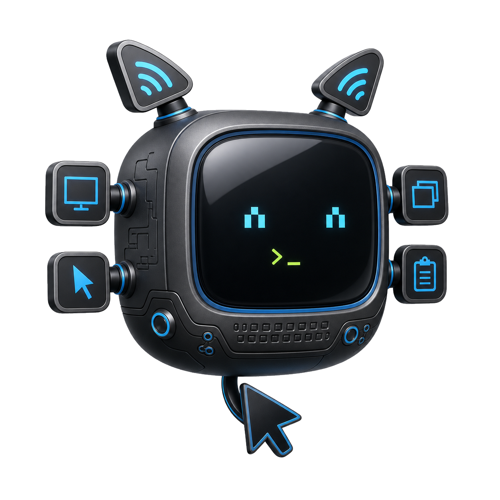

Give a trusted AI client useful control of a real Sway desktop—without adding a network service or pretending the security boundary does not exist.

computer-use-sway is a local MCP stdio server for inspecting and operating the current Wayland session through Sway-native tools. It turns the desktop into a small explicit capability surface instead of an opaque remote-control channel.

Screen and window inspection
Pointer control
Text and key chords
Clipboard access
Local stdio transport

## What the client can see and do

<article class="timeline-item">
  

  

    <header><h3>Observe the session</h3>Read
Outputs, seats, focused windows, and required binaries
</header>
    

The server returns the state needed to reason about the current desktop before acting. A simplified Sway tree provides stable window identity without exposing the full compositor structure as raw noise.

  

</article>

<article class="timeline-item">
  

  

    <header><h3>Capture the screen</h3>Image
Screenshots as MCP image content or data URLs
</header>
    

The client can receive a current visual surface through <code>grim</code>, then combine it with structured focus and window information.

  

</article>

<article class="timeline-item">
  

  

    <header><h3>Operate deliberately</h3>Write
Focus, point, click, drag, scroll, type, and send chords
</header>
    

Window targeting works by container ID, app ID, class, or title. Pointer and keyboard actions use native Wayland tools rather than an X11 compatibility path.

  

</article>

<article class="timeline-item">
  

  

    <header><h3>Exchange text</h3>Clipboard
Read and write the text clipboard
</header>
    

Clipboard capabilities use <code>wl-clipboard</code> and remain separate from keyboard entry, so the client can choose the least disruptive mechanism for a task.

  

</article>

## A narrow local bridge

<aside class="alert">
This server gives an MCP client practical control of the active desktop. It should only be registered with local clients the user trusts.
</aside>

There is no HTTP listener and no remote account. The MCP host launches the server over stdio. When that host starts with a sanitized environment, the server reconstructs `XDG_RUNTIME_DIR`, `SWAYSOCK`, and `WAYLAND_DISPLAY` from the active local session, then diagnoses the required tools before accepting desktop work.

<pre class="not-prose mermaid">sequenceDiagram
    participant Client as Trusted MCP client
    participant Server as computer-use-sway
    participant Sway as Sway / Wayland tools
    Client-&gt;&gt;Server: Inspect session
    Server-&gt;&gt;Sway: swaymsg / grim
    Sway--&gt;&gt;Server: Tree, focus, screenshot
    Server--&gt;&gt;Client: Structured state + image
    Client-&gt;&gt;Server: Explicit input action
    Server-&gt;&gt;Sway: wtype / pointer / clipboard</pre>

## Project identity

## Repository

<a href="https://github.com/blackopsrepl/computer-use-sway">blackopsrepl/computer-use-sway</a>

<a class="button" href="https://github.com/blackopsrepl/computer-use-sway" target="_blank"> Source and setup</a>
