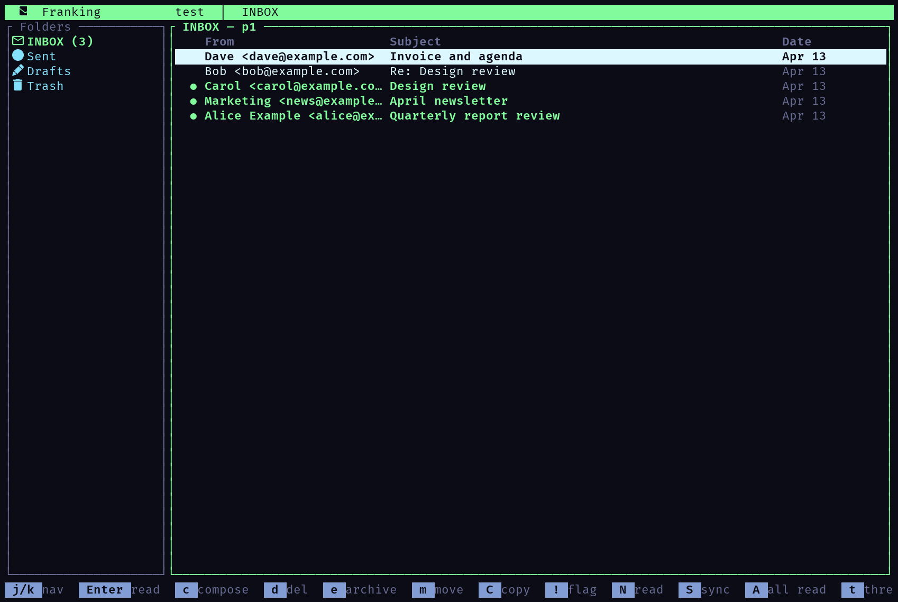
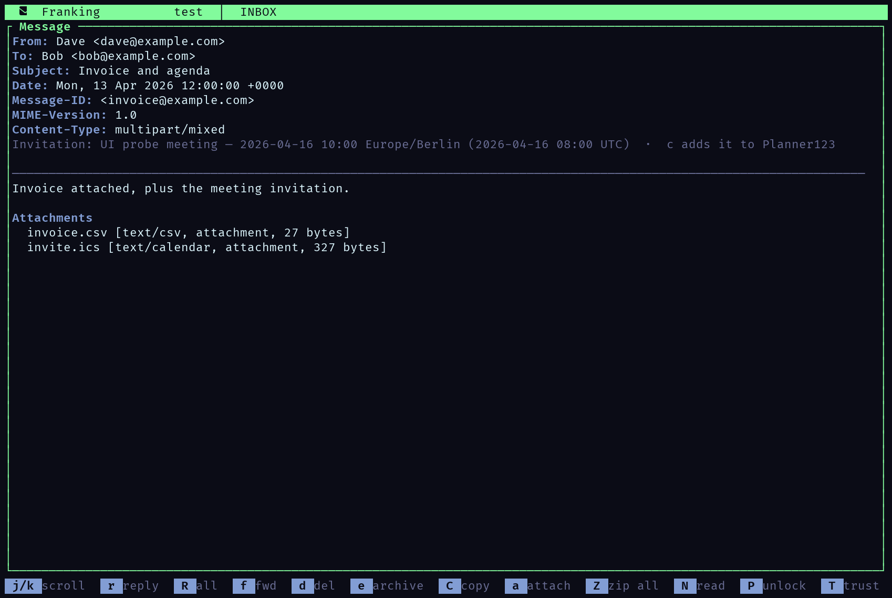
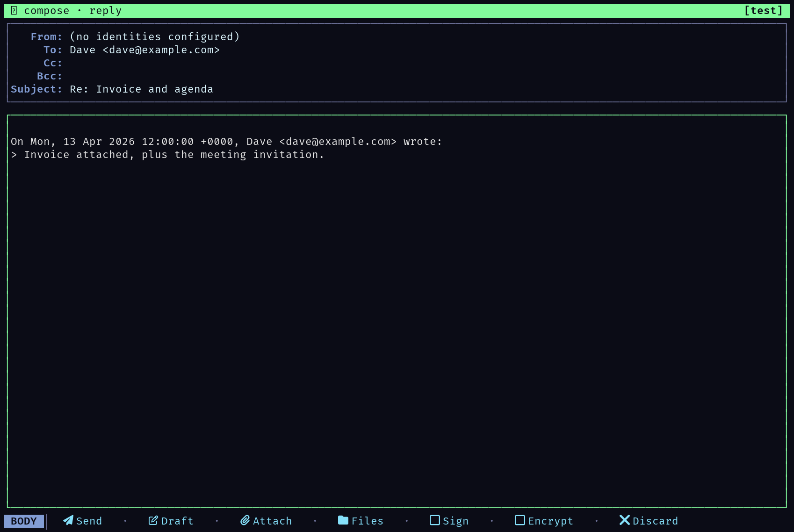
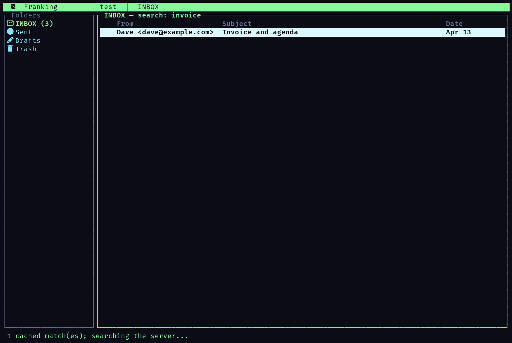

A terminal email client that owns its mail layer—native IMAP/SMTP transport, a local SQLite store, and a keyboard-driven workflow built for real triage.

Franking is a ratatui TUI email client with an app-owned mail layer. Accounts, endpoints, auth bindings, and secret references live in SQLite; raw secrets stay in the OS keyring. A shared MIME parser produces one canonical view of a message, and a background worker pool keeps every mail operation off the render path.

Native IMAP/SMTP
Local SQLite store
PGP &amp; S/MIME
Multi-account
Ratatui TUI

## Built for triage, not just reading

<article class="timeline-item">
  

  

    <header><h3>Folders and messages</h3>Core
Unread counts, per-account folders, threaded or flat
</header>
    

Server-side ordering with a local cache, relative timestamps, mouse support, and an "All Inboxes" folder that merges every account's inbox when more than one is configured.

  

</article>

<article class="timeline-item">
  

  

    <header><h3>Reader</h3>MIME
Structured content, attachments, invitations
</header>
    

Raw messages are parsed once and rendered as structured content with one canonical HTML-first path. Attachments preview in place, save individually, or write out as an archive, and <code>text/calendar</code> events show their summary and timezone and can be handed to Planner123.

  

</article>

<article class="timeline-item">
  

  

    <header><h3>Compose</h3>Authoring
Reply, forward, attachments, drafts
</header>
    

A single authoritative input router resolves focus buckets, popups, and shortcuts in a deterministic precedence order, so modal interactions stay predictable. PGP and S/MIME toggles sit beside snippets, in-body search, and save-as-draft.

  

</article>

<article class="timeline-item">
  

  

    <header><h3>Triage lanes</h3>Workflow
Screening, follow-up, quiet conversations
</header>
    

An inbox cycles through Screening, Inbox, Reading, Receipts, and Blocked, and <code>1</code>–<code>5</code> routes a sender for the receiving account. Follow-up queues, quiet and resurfacing timers, local annotations, sender bundles, and workflow stages keep a high-volume mailbox operable without leaving the keyboard.

  

</article>

<article class="timeline-item">
  

  

    <header><h3>Accounts and secrets</h3>Trust
Discovery, SQLite metadata, OS keyring
</header>
    

Add an account by email: Google, iCloud, and Outlook presets, then Mozilla autoconfig, Microsoft Autodiscover, and RFC 6186 SRV. SQLite stores definitions, endpoints, auth bindings, and secret references; the raw secrets stay in the OS keyring. Versioned migrations preserve local decisions and fail safely on an unsupported database.

  

</article>

## Screenshots

Every image below is the running application, rendered from its own cell grid with the colours it chose.

## Architecture

<pre class="not-prose mermaid">graph TD
    TUI[Ratatui TUI - Elm architecture] --&gt; Worker[Async worker pool]
    Worker --&gt; Service[MailService trait]
    Service --&gt; IMAP[Native IMAP]
    Service --&gt; SMTP[Native SMTP]
    Service --&gt; Maildir[Local maildir]
    Service --&gt; DB[(SQLite: accounts, contacts, identities)]
    Service --&gt; Keyring[OS keyring: secrets]
    Service --&gt; MIME[Shared MIME parser]</pre>

## An app-owned mail layer

<aside class="alert">
Franking does not wrap a system mail client. It owns the account store, the MIME parser, the crypto keyring, and the transport, so behaviour is explicit and testable end to end.
</aside>

OpenPGP (inline and PGP/MIME) and S/MIME (PKCS#7 signed and enveloped) verify and decrypt against a local keyring, and SPF, DKIM, and DMARC verdicts are surfaced from <code>Authentication-Results</code>. Live integration tests run Dovecot and Mailpit in throwaway containers, and the local <code>test</code> maildir account works with no network and no external dependencies.

## Repository

<a href="https://github.com/blackopsrepl/Franking">blackopsrepl/Franking</a>

<a class="button" href="https://github.com/blackopsrepl/Franking" target="_blank"> Source and setup</a>
