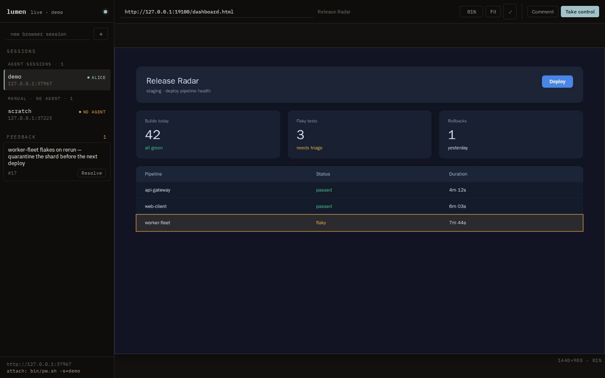
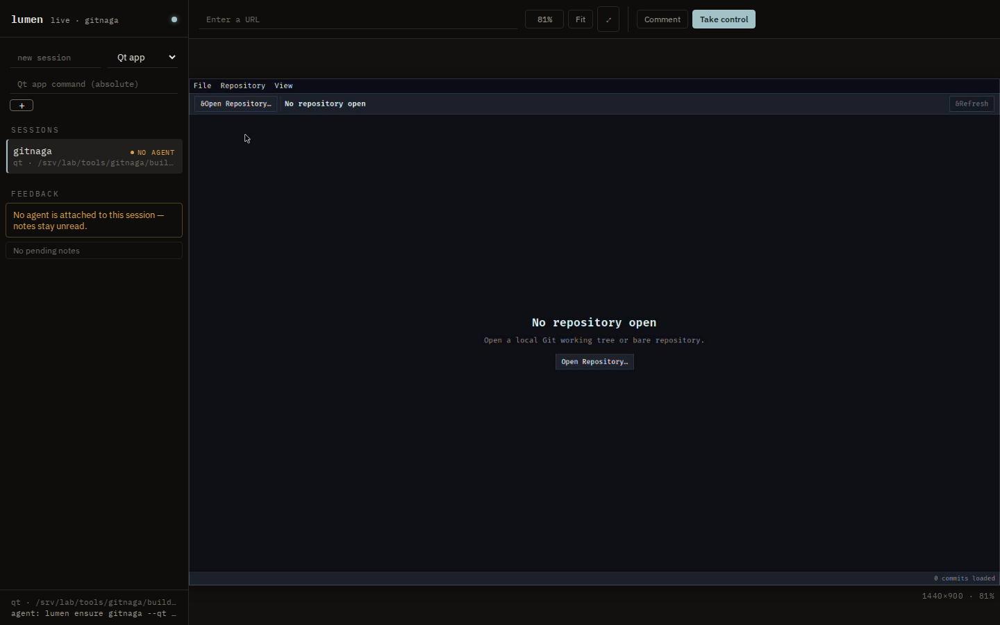
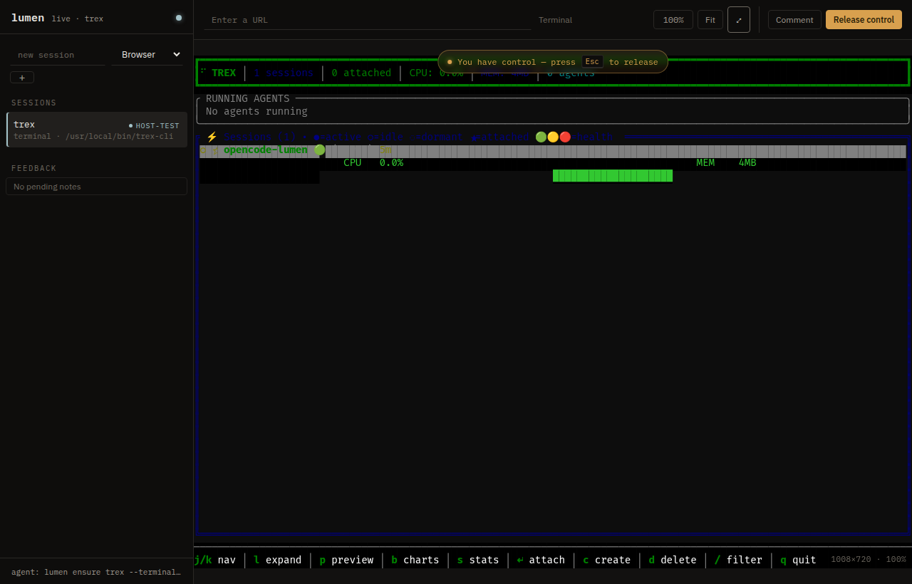
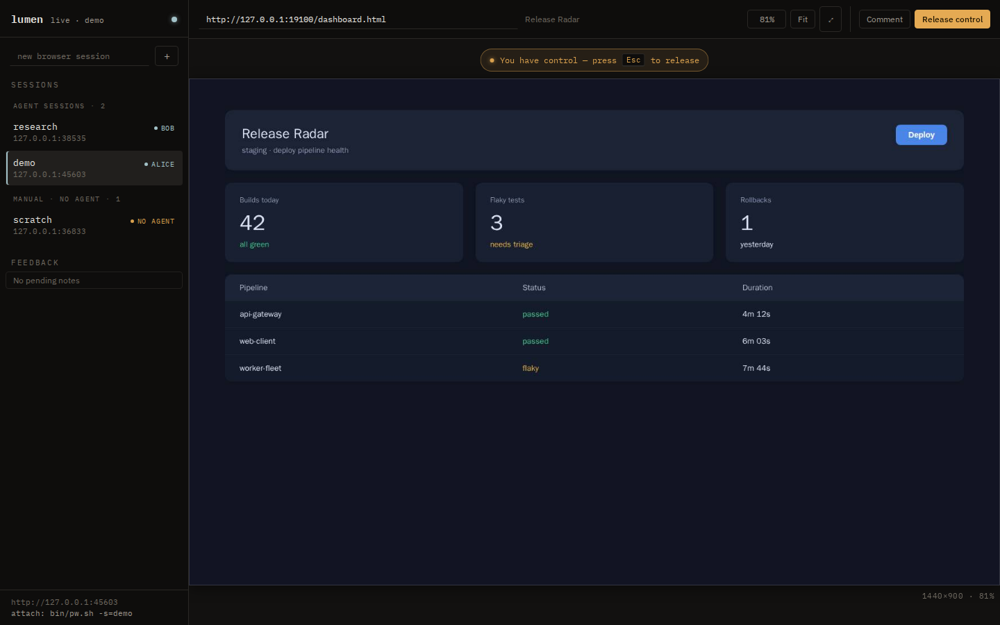

Give every agent its own isolated surface—a real browser, a Qt application, a Quickshell desktop, or a terminal—and let the human watch, take over, and leave notes on the very same session.

lumen is a single-binary session service. Agents drive real pages over a capability API or raw CDP, read and click a Qt application through its accessibility tree, and read terminals as text; the human sees the active surface live, can take control at any moment, and annotates the region that matters. It is one process, one config file, and one viewer.

Isolated sessions
Live viewer
Accessibility tree
Human feedback
Loopback only

## Four surfaces, one contract

<article class="timeline-item">
  

  

    <header><h3>Browser sessions</h3>CDP
Isolated Chromium, driven over the DevTools protocol
</header>
    

Each session is its own Chromium with a private profile. Agents attach <code>playwright-cli</code> over CDP to navigate, snapshot the accessibility tree with element refs, click and fill by ref, and screenshot. Tabs the browser opens on its own are adopted automatically, so the viewer always shows the tab the browser is actually displaying.

  

</article>

<article class="timeline-item">
  

  

    <header><h3>Qt applications</h3>Accessibility
Read and click a real desktop app
</header>
    

An absolute program runs under its own headless Sway compositor and private D-Bus. The application publishes its controls as a structured tree of role, name, state, and bounds; an agent clicks a node's <code>ref</code> through the same virtual pointer the viewer uses. The endpoint refuses a tree that published nothing addressable instead of serving a skeleton the caller cannot distinguish from a real one.

  

</article>

<article class="timeline-item">
  

  

    <header><h3>Terminal sessions</h3>PTY
Run any program unmodified
</header>
    

A real pseudoterminal is parsed into the same structured cell grid every other surface produces, so an unmodified ratatui app, <code>htop</code>, or a shell becomes a session an agent reads as text with no screenshot and no vision. Apps that link the <code>lumen-ratatui</code> crate skip the PTY and ship ratatui's own buffer diff instead.

  

</article>

<article class="timeline-item">
  

  

    <header><h3>Quickshell desktops</h3>Wayland
A full shell per session
</header>
    

Each session runs one headless Sway compositor and one Quickshell process. The human watches the native Wayland output and drives mouse, wheel, and text input. Quickshell publishes no accessible objects, so these sessions stay screenshot-only.

  

</article>

<article class="timeline-item">
  

  

    <header><h3>Human feedback</h3>Loop
A note the agent reads back
</header>
    

The human drags a rectangle and types a note; lumen captures those pixels as a PNG the moment the note is sent, stores it in SQLite, and hands it to the agent on its next <code>lumen feedback</code> call. Notes are keyed by session name and survive the session ending, so nothing is lost when a backend exits.

  

</article>

## One viewer for every surface

The view plane is unified: browser sessions stream over CDP screencasting, Qt and Quickshell sessions use native Wayland screencopy, and terminal sessions stream the app's own buffer diff. All of it renders to one canvas, and zoom is view-only—scroll zooms and drag pans without sending input until the human takes control.

## Architecture

<pre class="not-prose mermaid">graph TD
    Agent[Agent CLI or CDP] --&gt; API[HTTP/JSON control plane /v1]
    Human[Human viewer] --&gt; View[View plane: CDP, Wayland, cell diff]
    API --&gt; Supervisor[lumen supervisor]
    Supervisor --&gt; Chromium[Chromium session]
    Supervisor --&gt; Qt[Qt session + AT-SPI]
    Supervisor --&gt; Quickshell[Quickshell + Sway]
    Supervisor --&gt; Pty[Terminal PTY]
    Chromium --&gt; View
    Qt --&gt; View
    Quickshell --&gt; View
    Pty --&gt; View
    Human --&gt; Feedback[Feedback in SQLite]
    Feedback --&gt; Agent</pre>

## A local, bounded service

<aside class="alert">
lumen binds loopback only and the container runs with <code>no-new-privileges</code>. It is built for a trusted local operator, not for exposure on a network.
</aside>

Navigation host policy lives under <code>[policy]</code> in <code>config/lumen.toml</code>, and it is enforced per tab inside the browser: Lumen installs a navigation check on every tab it mediates, so a blocked navigation is refused no matter which session issues it—Lumen's API, an agent's own CDP connection, or a redirect. Coverage has an explicit boundary: a tab an agent creates entirely outside Lumen's API is not checked until the API touches it. The policy bounds Lumen-mediated browsing; it is not a sandbox for an agent's direct browser control. The audit trail at <code>GET /v1/audit</code> records navigations, tab operations, raw CDP calls, feedback, and session reaps, so a session can vanish from the list without a <code>DELETE</code>—but never without a trace.

## Repository

<a href="https://github.com/blackopsrepl/lumen">blackopsrepl/lumen</a>

<a class="button" href="https://github.com/blackopsrepl/lumen" target="_blank"> Source and setup</a>
