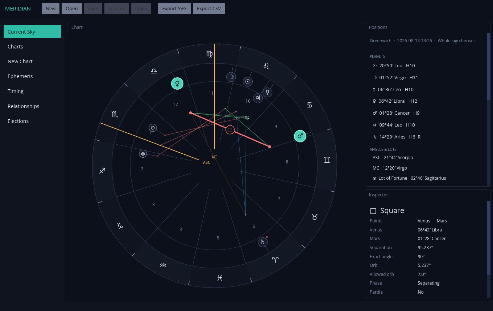
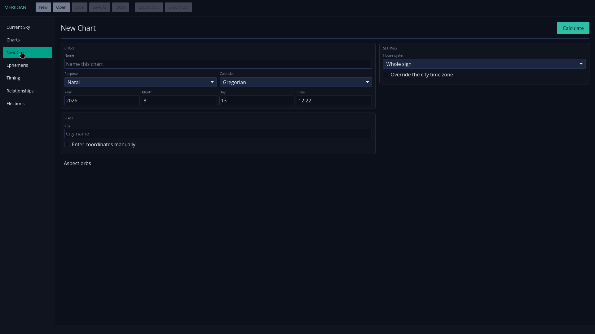

A native traditional-astrology workbench that turns a large historical rule system into inspectable calculations, local research tools, and reproducible searches.

Meridian calculates, inspects, compares, archives, and exports charts using bundled Swiss Ephemeris data and a local city atlas. It is a desktop product rather than a web shell—its calculation engine, archive, resources, and interface travel together on Linux, Windows, and macOS.

Fully offline
Traditional techniques
Private local archive
Bundled city atlas
Native packages

## Why this is a complex software problem

Astrology is often encountered as loose interpretation, generated horoscope copy, or decorative chart imagery. Meridian addresses a different problem: implementing a specific classical tradition as an explicit and testable computational system.

That requires several layers to agree:

- civil date, local time, historical time-zone rules, latitude, and longitude must resolve to one unambiguous instant;
- Swiss Ephemeris positions and house cusps must be calculated from pinned local data;
- circular geometry must handle aspects, applying and separating motion, retrogradation, lots, antiscia, and exact events across the 0° boundary;
- multiple house systems and day/night reversals change derived results;
- doctrine combines rulership, dignity, sect, solar condition, angularity, reception, and topical significance;
- every conclusion must remain traceable to its inputs and intermediate conditions rather than collapse into an unexplained verdict.

The difficulty is therefore not proving astrology’s premises. It is faithfully encoding a large, internally structured body of rules while keeping astronomical calculation, historical doctrine, persistence, and presentation separate enough to inspect and test.

## The workspace

The chart wheel and inspector are one interactive surface: selecting a planet, aspect, sign, house, angle, or lot highlights every connected element and exposes its exact data. The remaining workspaces keep creation, research, timing, comparison, and retrieval close at hand.

  
  

## One application, connected workflows

<article class="timeline-item">
  

  

    <header><h3>Calculate and inspect</h3>Core
Natal, event, horary, mundane, and electional charts
</header>
    

The resizable wheel, positions list, and inspector expose the same immutable calculated chart. Whole Sign, Equal, Porphyry, Alcabitius, Placidus, Regiomontanus, Campanus, and Morinus houses are available.

  

</article>

<article class="timeline-item">
  

  

    <header><h3>Research through time</h3>Timing
Techniques that stay connected to the open chart
</header>
    

Transits, secondary progressions, solar arcs, harmonics, profections, firdaria, returns, planetary hours, and bounded election searches share the same local calculation layer.

  

</article>

<article class="timeline-item">
  

  

    <header><h3>Compare charts</h3>Relationships
Synastry, midpoint composite, and Davison methods
</header>
    

Relationship work produces an inspectable comparison and can export its result as SVG, alongside the application’s chart-document and CSV workflows.

  

</article>

<article class="timeline-item">
  

  

    <header><h3>Keep a private archive</h3>Local
SQLite persistence with portable chart documents
</header>
    

New calculations enter a local archive automatically. A <code>.meridian</code> document remains editable and portable; SVG and CSV are explicit exports rather than lossy substitutes for the chart.

  

</article>

## Calculation integrity

<aside class="alert" style="background: #092218; color: #d9ffe8">
Meridian reports missing precision data as an error. It does not silently substitute an analytical ephemeris or call a remote service.
</aside>

Civil times use IANA historical time-zone rules. Ambiguous local times require an explicit fold; nonexistent times are rejected. The calculation surface includes apparent tropical geocentric positions, traditional aspects and orbs, dignity, reception, sect, lots, antiscia, dodecatemoria, and planetary days and hours.

<pre class="not-prose mermaid">flowchart LR
    input[Local date, time, and place] --&gt; time[IANA time-zone resolution]
    time --&gt; calc[Swiss Ephemeris calculation]
    calc --&gt; chart[Immutable calculated chart]
    chart --&gt; wheel[Interactive workspace]
    chart --&gt; archive[SQLite archive]
    chart --&gt; export[Meridian / SVG / CSV]</pre>

## Where SolverForge could fit

**Electional astrology means choosing a time for something you already intend to do.** It does not ask when an event will mysteriously occur. It compares the possible start times for a wedding, journey, contract, medical treatment, property purchase, or other undertaking according to a defined set of astrological rules.

Meridian already performs that comparison: it evaluates a bounded time range at a chosen interval, calculates a complete chart for every instant, and ranks the candidates from visible testimonies and cautions. This is intentionally transparent—the result is not presented as an oracle, and every score component remains available for inspection.

### A concrete example: scheduling a wedding

Suppose a couple is choosing among three ceremony slots offered by a venue: **14:00, 15:30, or 17:00**.

Meridian evaluates those times under its *Marriage & union* model. It considers the condition of Venus, the Moon, the ruler of the seventh house, the Ascendant ruler, applying lunar aspects, and cautions such as strongly placed malefics. Imagine that it ranks the slots in this order:

| Meridian rank | Ceremony time | Astrological result |
| --- | --- | --- |
| 1 | 14:00 | Strongest testimonies |
| 2 | 15:30 | Good, with one caution |
| 3 | 17:00 | Acceptable, but less preferred |

The couple's real life adds a second set of facts:

- essential family members cannot reach the venue before 14:30;
- the photographer is unavailable from 15:15 to 16:15;
- the ceremony lasts 45 minutes;
- the reception must begin between 60 and 90 minutes after the ceremony;
- the venue, registrar, photographer, and reception room must all be available for the chosen sequence.

The **14:00** slot is astrologically strongest but impossible for the family. The **15:30** slot conflicts with the photographer. The **17:00** slot has the lower Meridian score, yet it may be the best feasible choice.

For three fixed slots, a person could check this by hand. The problem becomes an optimization problem when there are hundreds of candidate instants, several participants and resources, travel buffers, costs, dependencies, and preferences that can be relaxed at a penalty. SolverForge could model the non-negotiable requirements as **hard constraints**, the preferences as **soft constraints**, and Meridian's ranking as one part of the objective.

### The business parallel: maintenance planning

The same decision pattern appears in ordinary operations. Imagine a manufacturer that must schedule four hours of preventive maintenance on a packaging line.

An asset-health system ranks **Tuesday at 02:00** as the best intervention window because the machine's condition is expected to deteriorate after that point. But the replacement part will not arrive until Wednesday. **Wednesday at 22:00** is the next-best window, but the only certified technician would violate a rest rule. **Thursday at 01:00** carries a slightly higher equipment-risk score, yet the part, technician, production gap, and safety team are all available.

That is structurally the same problem as the wedding example:

| Specialist knowledge | Operational reality | Optimized decision |
| --- | --- | --- |
| Meridian ranks times from an electional model | People, venue, travel, and event dependencies | Choose the best feasible ceremony plan |
| An asset-health model ranks maintenance urgency | Technicians, parts, production orders, safety rules, and downtime cost | Choose the best feasible maintenance window |

The business value does not depend on astrology. The reusable pattern is **domain intelligence plus constrained decision-making**. A forecasting, risk, medical, engineering, or pricing model can say which options look desirable in its own vocabulary; SolverForge can determine which of those options the organization can actually execute, optimize the compromises, and report why the winning plan was chosen.

For the reader, Meridian is therefore more than a niche desktop application. It demonstrates the difficult first half of that architecture: turning specialist knowledge into structured, inspectable candidate facts instead of an opaque recommendation. SolverForge provides the complementary planning layer when those facts must survive contact with resources, rules, costs, and commitments.

Within Meridian alone, its current search is adequate when the question is simply “which instants rank best under this electional model?” Across both the wedding and maintenance examples, the integration pattern has the same four responsibilities:

<article class="timeline-item">
  

  

    <header><h3>The specialist system generates domain facts</h3>Scoring
Candidate options with evidence attached
</header>
    

Meridian would remain responsible for ephemeris calculation, doctrine, and the testimony attached to each time. In another business domain, the source might instead be a forecast, risk model, sensor system, or pricing engine.

  

</article>

<article class="timeline-item">
  

  

    <header><h3>The organization defines practical constraints</h3>Planning
Availability, resources, duration, dependencies, rules, and exclusions
</header>
    

These are the conditions a domain score cannot settle by itself: staff availability, resource capacity, opening hours, travel or setup time, legal rules, budgets, and activities that must occur in sequence.

  

</article>

<article class="timeline-item">
  

  

    <header><h3>SolverForge searches for a feasible, high-quality plan</h3>Optimization
Hard constraints and competing soft preferences
</header>
    

SolverForge could combine those operational requirements with the specialist rankings, reject infeasible choices, and search the remaining tradeoffs across one decision or an entire schedule. With a metaheuristic, the result is a high-quality feasible plan—not a proof that no better plan exists.

  

</article>

<article class="timeline-item">
  

  

    <header><h3>The result stays explainable</h3>Inspection
Why this time, what it satisfies, and what was traded away
</header>
    

The boundary preserves the strength of both systems: Meridian explains the domain calculation; SolverForge explains feasibility and optimization. Neither needs to hide the other behind a single opaque score.

  

</article>

<aside class="alert" style="background: #092218; color: #d9ffe8">
<strong>Current versus potential:</strong> Meridian’s election ranking exists today. The SolverForge planning layer described here is a natural integration path, not a claim that the two applications are already connected.
</aside>

<pre class="not-prose mermaid">flowchart LR
    request[Purpose, range, and location] --&gt; meridian[Meridian]
    meridian --&gt; candidates[Calculated candidate instants\nwith visible testimonies]
    reality[Calendars, resources, duration,\ndependencies, and user priorities] --&gt; solver[SolverForge]
    candidates --&gt; solver
    solver --&gt; result[Best feasible time or sequence\nwith constraint and score explanation]</pre>

[Explore SolverForge](https://solverforge.org) for the optimization engine and planning ecosystem.

## Native delivery

The same offline data set is packaged into AppImage, DEB, RPM, Windows installer, and universal macOS DMG builds. A companion CLI accepts a JSON request and emits JSON, SVG, or CSV through the same calculation model used by the desktop application.

## Repository

<a href="https://github.com/blackopsrepl/meridian">blackopsrepl/meridian</a>

<a class="button" href="https://github.com/blackopsrepl/meridian/releases/latest" target="_blank"> Download Meridian</a>
