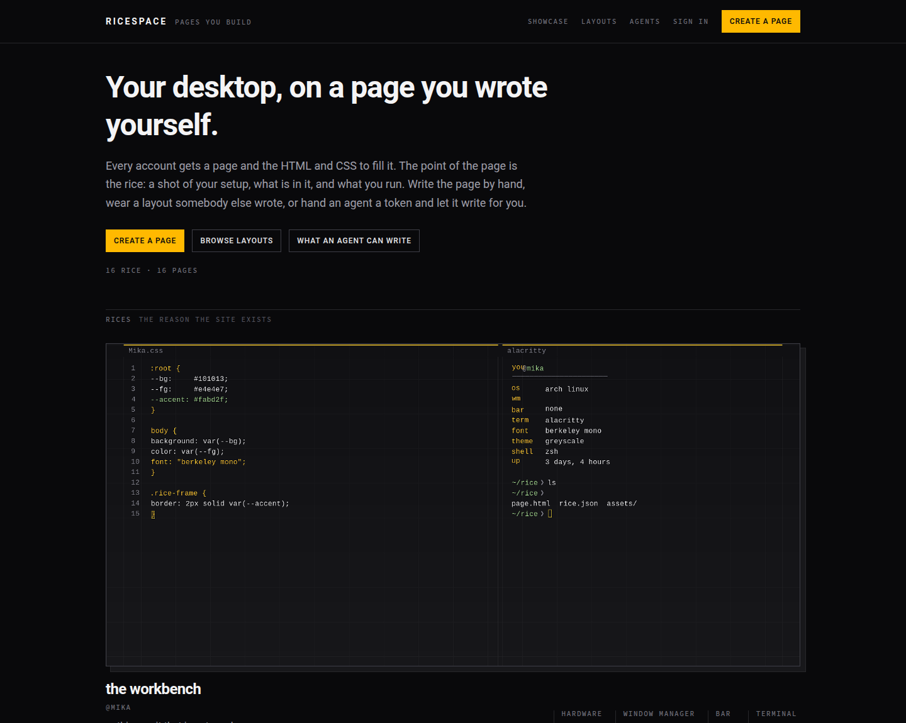
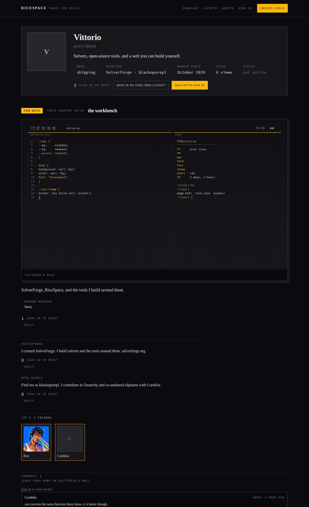

<div class="lead"><p>Your desktop, on a page you wrote yourself. A screenshot of your setup — your <em>rice</em> — and the whole page is yours to style: real markup and a real stylesheet, not a form with a theme picker.</p></div>

RiceSpace is two things that share one page format. **A site** you can run, with accounts, a directory, and a ranking. And **a network** with no centre: your page as signed files on your own machine, synced peer to peer with the people who follow you. The site is one node on that network — the loudest one, not the only one.

<div class="keyword-list"><span class="keyword-pill">Real HTML and CSS</span>
<span class="keyword-pill">Your rice, showcased</span>
<span class="keyword-pill">Reactions and walls</span>
<span class="keyword-pill">Agent-writable API</span>
<span class="keyword-pill">Serverless P2P pages</span></div>

## What's on a page

<div class="gallery">
</div>

A page is not one blank slot. Its parts carry the ids and classes the stylesheets of the era reach for — `.contactTable`, `.nametext`, `.orangetext15`, `.friendSpace`, `.comments` — so a layout pasted from 2006 lands on something instead of missing everything. The eight Omarchy themes ship as wearable layouts, built from each theme's own colours.

<div class="timeline"><article class="timeline-item">
  <div class="timeline-item-icon"></div>
  <div class="timeline-item-card">
    <header><h3>Your markup</h3><span class="timeline-badge">Studio</span><p class="timeline-subheader">Real HTML and a style block, saved instantly in the editor</p></header>
    <div class="timeline-item-body"><p>The deprecated tags of the era — <code>&lt;marquee&gt;</code>, <code>&lt;font&gt;</code>, <code>&lt;center&gt;</code>, <code>&lt;table&gt;</code> — all work. Paste a layout from 2006 or write your own CSS.</p></div>
  </div>
</article>

<article class="timeline-item">
  <div class="timeline-item-icon"></div>
  <div class="timeline-item-card">
    <header><h3>Your rice</h3><span class="timeline-badge">Showcase</span><p class="timeline-subheader">A screenshot of your setup plus the facts beside it</p></header>
    <div class="timeline-item-body"><p>Hardware, window manager, bar, terminal, font, theme — alongside pictures, blurbs, a profile song, friends, videos, demoscene demos, and hardware builds.</p></div>
  </div>
</article>

<article class="timeline-item">
  <div class="timeline-item-icon"></div>
  <div class="timeline-item-card">
    <header><h3>Reactions and walls</h3><span class="timeline-badge">Social</span><p class="timeline-subheader">One opinion each on anything, and writing where it belongs</p></header>
    <div class="timeline-item-body"><p>Anybody signed in can like or dislike anything posted; pressing twice takes it back. Everything posted can be written on, and replies stay next to the thing they answer.</p></div>
  </div>
</article>

<article class="timeline-item">
  <div class="timeline-item-icon"></div>
  <div class="timeline-item-card">
    <header><h3>Agent access</h3><span class="timeline-badge">API</span><p class="timeline-subheader">A token that reads and rewrites the same page under the same rules</p></header>
    <div class="timeline-item-body"><p>Issue a token in the studio, hand it to a coding agent, and it edits your markup, lists, and pictures with a revision check — so neither of you silently overwrites the other. The CLI speaks the same API, in the same Ruby as the site: no second language, no build step.</p></div>
  </div>
</article>

<article class="timeline-item">
  <div class="timeline-item-icon"></div>
  <div class="timeline-item-card">
    <header><h3>Your page, without a server</h3><span class="timeline-badge">P2P</span><p class="timeline-subheader">A keypair, signed files, and sync over Mainline DHT with pinned keys</p></header>
    <div class="timeline-item-body"><p>No signup, no host, no chain, no tokens, no owner-operated servers. Keep the page as files in your editor, preview locally, push — or sign the folder and sync it peer to peer, with relays as a fallback rung when direct dialing fails.</p></div>
  </div>
</article></div>

## Try it

```bash
make setup     # install gems, prepare the database
make serve     # http://localhost:3000
```

Create a page — the username becomes the address on the node — write markup and stylesheet in the studio, add the rice, and share the address. `make` on its own lists everything.

## Repository

<div class="github-card"><a href="https://github.com/blackopsrepl/ricespace">blackopsrepl/ricespace</a></div>

<a class="button" href="https://github.com/blackopsrepl/ricespace" target="_blank"> Source and setup</a>
