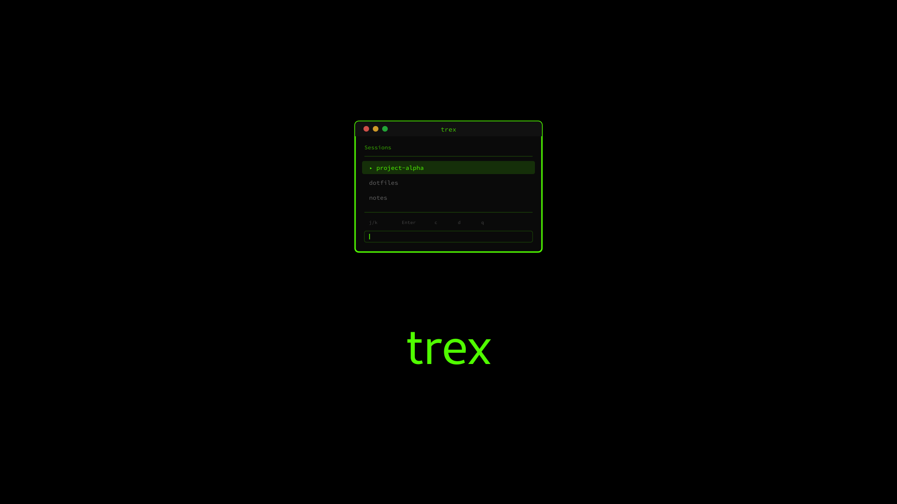
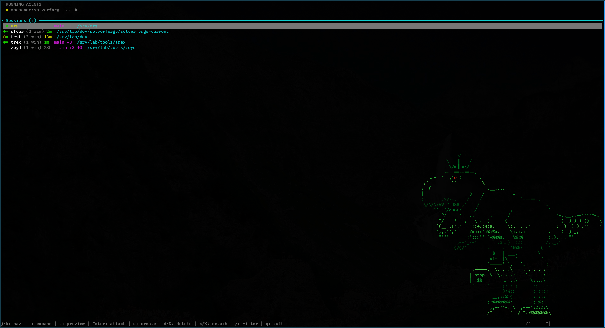

<div class="lead"><p><span class="typeit">A fast, minimal tmux session manager with fuzzy finding and vim-like keybindings.</span></p></div>

<div class="keyword-list"><span class="keyword-pill">Interactive TUI</span>
<span class="keyword-pill">Fuzzy Finding</span>
<span class="keyword-pill">Vim Keybindings</span>
<span class="keyword-pill">Zero Config</span>
<span class="keyword-pill">Open Source</span></div>

---

## Screenshots

<div class="gallery">
  </div>

---

## GitHub

<div class="github-card"><a href="https://github.com/blackopsrepl/trex">blackopsrepl/trex</a></div>

---

## Installation

### Cargo <span class="badge">Recommended</span>

```bash
cargo install trex
```

The easiest way to install trex if you have Rust installed.

### Binary Download

Download the latest release from GitHub:

```bash
# Download
curl -LO https://github.com/blackopsrepl/trex/releases/latest/download/trex-linux-x86_64.tar.gz

# Extract
tar -xzf trex-linux-x86_64.tar.gz

# Install
sudo mv trex /usr/local/bin/
```

<aside class="alert"><p>Pre-built binaries are statically linked for universal Linux compatibility.</p></aside>

### Build from Source

```bash
git clone https://github.com/blackopsrepl/trex
cd trex
cargo build --release
```

The binary will be at `target/release/trex`.

---

## Quick Start

<aside class="alert" style="background: #ff6b6b; color: #ffffff"><p><strong>trex must be run from outside tmux.</strong> If you try to run it from within a tmux session, it will exit with an error message.</p></aside>

```bash
# Just run it
trex
```

That's it. No configuration files needed.

<aside class="alert" style="background: #1a1a2e; color: #ffffff"><p><strong>Zsh Keybinding</strong> — Add this to your <code>.zshrc</code> to launch trex with <code>Ctrl+T</code>:</p>

<p><code>zsh
trex-widget() {
  zle push-input
  BUFFER="trex"
  zle accept-line
}
zle -N trex-widget
bindkey '^T' trex-widget
</code></p></aside>

---

## Features

<div class="timeline"><article class="timeline-item">
  <div class="timeline-item-icon"></div>
  <div class="timeline-item-card">
    <header><h3>Session Management</h3><span class="timeline-badge">Core</span><p class="timeline-subheader">Browse &amp; Control</p></header>
    <div class="timeline-item-body"><p>Create, attach, delete, and detach tmux sessions with simple keyboard shortcuts. Navigate with vim-like keybindings.</p></div>
  </div>
</article>


<article class="timeline-item">
  <div class="timeline-item-icon"></div>
  <div class="timeline-item-card">
    <header><h3>Fuzzy Search</h3><span class="timeline-badge">Fast</span><p class="timeline-subheader">Powered by nucleo</p></header>
    <div class="timeline-item-body"><p>Quickly filter sessions and directories with fuzzy matching. The same algorithm used by popular fuzzy finders, optimized for speed.</p></div>
  </div>
</article>


<article class="timeline-item">
  <div class="timeline-item-icon"></div>
  <div class="timeline-item-card">
    <header><h3>Directory Discovery</h3><span class="timeline-badge">Smart</span><p class="timeline-subheader">Filesystem Scan</p></header>
    <div class="timeline-item-body"><p>Discover directories across your filesystem with configurable depth (1-6 levels). Automatically prioritizes your current directory and common project locations.</p></div>
  </div>
</article>


<article class="timeline-item">
  <div class="timeline-item-icon"></div>
  <div class="timeline-item-card">
    <header><h3>Smart Selection</h3><span class="timeline-badge">Context</span><p class="timeline-subheader">Auto-preselect</p></header>
    <div class="timeline-item-body"><p>Automatically preselects sessions matching your current working directory. First by exact path match, then by directory name.</p></div>
  </div>
</article></div>

---

## Keybindings

### Normal Mode

| Key | Action |
|-----|--------|
| `j` / `k` | Navigate down / up |
| `g` / `G` | Jump to first / last |
| `Enter` | Attach to session |
| `c` | Create new session (directory mode) |
| `d` | Delete selected session |
| `D` | Delete all sessions |
| `x` | Detach from selected session |
| `X` | Detach all clients |
| `/` | Enter filter mode |
| `q` / `Esc` | Quit |

### Directory Selection Mode

| Key | Action |
|-----|--------|
| `j` / `k` | Navigate directories |
| `g` / `G` | Jump to first / last |
| `Enter` | Create session in directory |
| `Tab` | Complete filter with path |
| `+` / `-` | Increase / decrease scan depth |
| `Esc` | Cancel and return |

### Filter Mode

| Key | Action |
|-----|--------|
| *Type* | Filter sessions/directories |
| `Backspace` | Delete character |
| `Esc` | Exit filter mode |

---

## Architecture

<pre class="not-prose mermaid">graph TD
    subgraph CLI[&quot;trex CLI&quot;]
        A[main.rs]
    end

    subgraph TUI[&quot;TUI Module&quot;]
        B[app.rs&lt;br/&gt;State &amp; Logic]
        C[events.rs&lt;br/&gt;Key Handling]
        D[ui.rs&lt;br/&gt;Rendering]
    end

    subgraph TMUX[&quot;tmux Integration&quot;]
        E[commands.rs&lt;br/&gt;TmuxClient]
        F[parser.rs&lt;br/&gt;Session Parser]
        G[session.rs&lt;br/&gt;TmuxSession]
    end

    subgraph DISCO[&quot;Directory Discovery&quot;]
        H[directory.rs&lt;br/&gt;Filesystem Scan]
    end

    A --&gt; B
    A --&gt; E
    A --&gt; H

    B --&gt; C
    B --&gt; D
    B -.-&gt; |nucleo| I[Fuzzy Matching]

    E --&gt; F
    E --&gt; G

    D -.-&gt; |ratatui| J[Terminal UI]
    D -.-&gt; |crossterm| K[Raw Mode]</pre>

---

## Highlights

<aside class="alert" style="background: #1a1a2e; color: #ffffff"><p><strong>Single binary, zero config</strong> — Just run <code>trex</code> and start managing sessions. No configuration files, no setup, no dependencies.</p></aside>

<aside class="alert" style="background: #1a1a2e; color: #ffffff"><p><strong>Blazingly fast</strong> — Written in Rust with the <code>nucleo</code> fuzzy matching library. Handles thousands of directories instantly.</p></aside>

<aside class="alert" style="background: #1a1a2e; color: #ffffff"><p><strong>Static builds</strong> — Pre-built binaries are statically linked for universal Linux compatibility. No runtime dependencies.</p></aside>

---

## Tech Stack

<div class="keyword-list"><span class="keyword-pill">Rust</span>
<span class="keyword-pill">ratatui</span>
<span class="keyword-pill">crossterm</span>
<span class="keyword-pill">nucleo</span>
<span class="keyword-pill">anyhow</span>
<span class="keyword-pill">thiserror</span></div>

---

## Links

<a class="button" href="https://github.com/blackopsrepl/trex" target="_blank"> View on GitHub</a>

<a class="button" href="https://github.com/blackopsrepl/trex/releases" target="_blank"> Download Releases</a>

<a class="button" href="https://crates.io/crates/trex" target="_blank"> crates.io</a>
